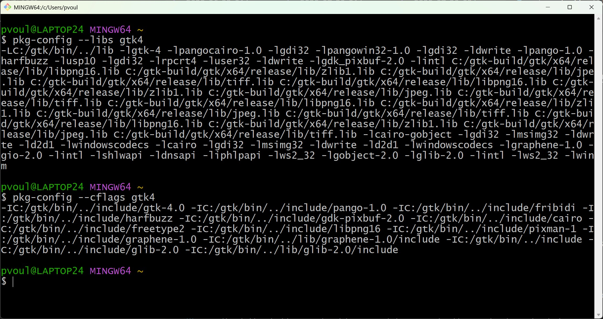
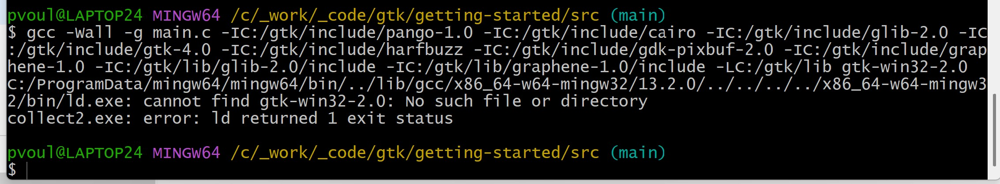

# GTK Widget Toolkit Sample

## `Sunday, 7/20/25`

- Able to build with the full `MSYS2` environment
- Noted that my `git-bash` shell appears to have an incorrect setup (the entries for `gtk-build`)



```text
cannot open source file "glib.h" (dependency of "C:\Users\Peter\.vscode\extensions\ms-vscode.cpptools-1.26.3-win32-x64\bin\gtk\gtk.h")

                "C:/gtk/include/gtk-4.0",
                "C:/gtk/include/pango-1.0/**",
                "C:/gtk/include/harfbuzz/**",
                "C:/gtk/include/gdk-pixbuf-2.0/**",
                "C:/gtk/include/graphene-1.0/**",
                "C:/gtk/lib/graphene-1.0/include/**"

```

## `Sunday, 6/22/25`

- So, I can compile on `mingw64` command-shell, but...
- The executable doesn't actually run except in a `Git Bash` command-shell \
  (within which I can _NOT_ compile)

## `Sunday, 6/15/25`

- Trying the approach outlined [here](https://www.gtk.org/docs/installations/windows/) for using `MSYS2`
- Using command-line:

```bash
gcc $(pkg-config --cflags gtk4) -o main main.c $(pkg-config --libs gtk4)
```

- And finally, I got this to work!

## `Saturday, 6/14/25`

- Working through the [Getting Started](https://docs.gtk.org/gtk4/getting_started.html#building-applications) documentation on my Windows Desktop Development Machine
- Also, see [here](https://docs.gtk.org/gtk4/getting_started.html#building-applications)
- Followed documentation from [here](https://github.com/wingtk/gvsbuild) to download the compiled binaries and set things up
- Used the following build command to compile the initial empty file:

```bash
g++ -g main.c -I C:/gtk/include/pango-1.0 -I C:/gtk/include/cairo -I C:/gtk/include/glib-2.0 -I C:/gtk/include/gtk-4.0 -I C:/gtk/include/harfbuzz -I C:/gtk/include/gdk-pixbuf-2.0 -I C:/gtk/include/graphene-1.0 -I C:/gtk/lib/glib-2.0/include -I C:/gtk/lib/graphene-1.0/include -L C:/gtk/lib -l gtk-win32-2.0 -l gdk-win32-2.0 -l atk-1.0 -l gio-2.0 -l gdk_pixbuf-2.0 -l pangowin32-1.0 -l gdi32 -l pangocairo-1.0 -l pango-1.0 -l cairo -l gobject-2.0 -l gmodule-2.0 -l gthread-2.0 -l glib-2.0 -l intl
```

```bash
g++ -Wall -g main.c -I C:/gtk/include/pango-1.0 -I C:/gtk/include/cairo -I C:/gtk/include/glib-2.0 -I C:/gtk/include/gtk-4.0 -I C:/gtk/include/harfbuzz -I C:/gtk/include/gdk-pixbuf-2.0 -I C:/gtk/include/graphene-1.0 -I C:/gtk/lib/glib-2.0/include -I C:/gtk/lib/graphene-1.0/include -L C:/gtk/lib -lgtk-win32-2.0 -lgdk-win32-2.0 -latk-1.0 -lgio-2.0 -lgdk_pixbuf-2.0 -lpangowin32-1.0 -lgdi32 -lpangocairo-1.0 -lpango-1.0 -lcairo -lgobject-2.0 -lgmodule-2.0 -lgthread-2.0 -lglib-2.0 -lintl
```

```bash
gcc -Wall \
-g main.c \
-I C:/gtk/include/pango-1.0 \
-I C:/gtk/include/cairo \
-I C:/gtk/include/glib-2.0 \
-I C:/gtk/include/gtk-4.0 \
-I C:/gtk/include/harfbuzz \
-I C:/gtk/include/gdk-pixbuf-2.0 \
-I C:/gtk/include/graphene-1.0 \
-I C:/gtk/lib/glib-2.0/include \
-I C:/gtk/lib/graphene-1.0/include \
-L C:/gtk/lib \
-l gtk-win32-2.0 \
-l gdk-win32-2.0 \
-l atk-1.0 \
-l gio-2.0 \
-l gdk_pixbuf-2.0 \
-l pangowin32-1.0 \
-l gdi32 \
-l pangocairo-1.0 \
-l pango-1.0 \
-l cairo \
-l gobject-2.0 \
-l gmodule-2.0 \
-l gthread-2.0 \
-l glib-2.0 \
-l intl
```

- I wanted to get a minimalist sample setup, with as little tooling as possible and see where it goes
- Adding `LIB` environment variable didn't seem to do anything
- Still not working, getting:



- It appears that I have not correctly setup or figured out how to set the library path for the linker to recognize this
